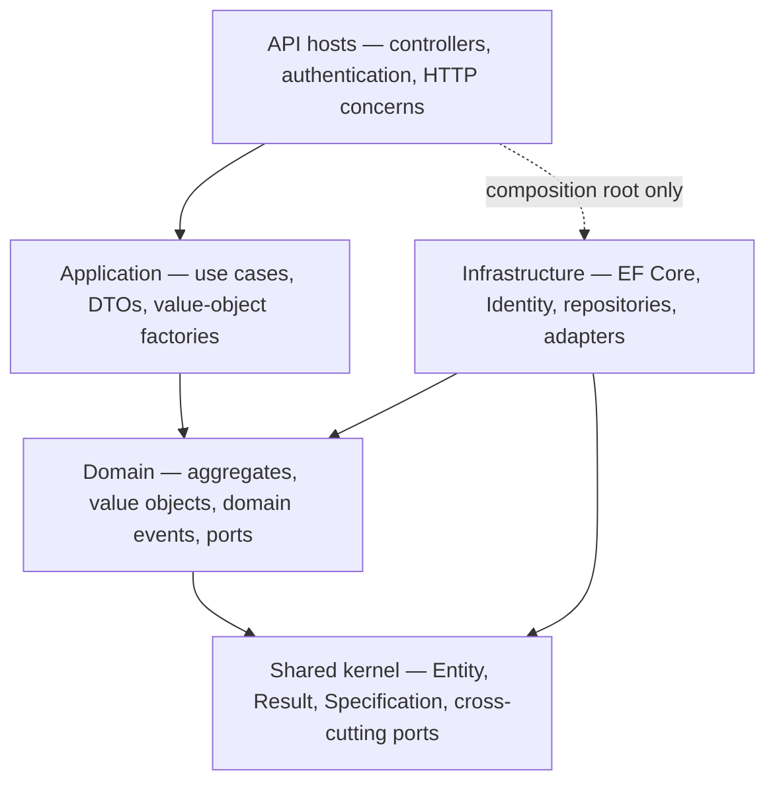
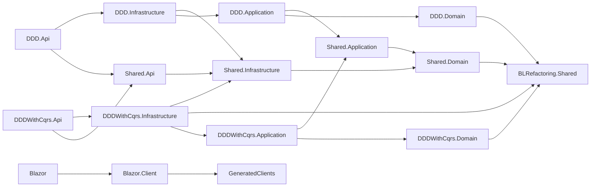
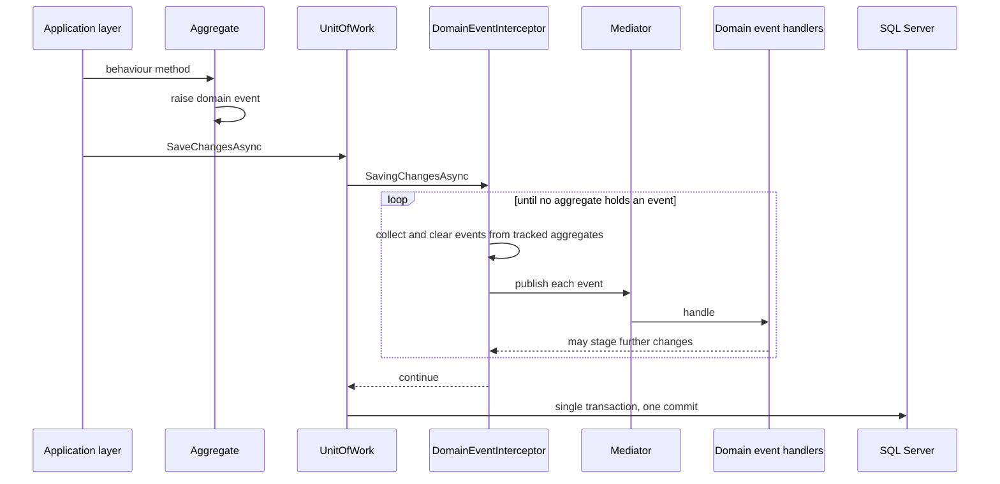
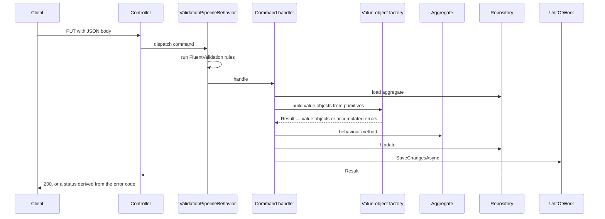
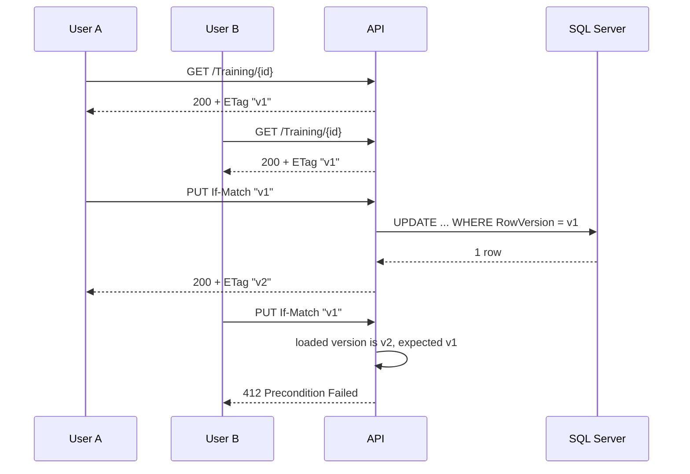

# BLRefactoring

[](https://github.com/maxime-poulain/BLRefactoring/actions/workflows/ci.yml)

A .NET 10 reference implementation that runs **two application styles over one shared domain
model**: a classic layered DDD stack and a CQRS stack. Both expose the same trainer/training
business capabilities, persist through the same EF Core model against SQL Server, and react to
the same domain events — so the two styles can be compared on identical ground rather than on
two different problems.

---

## Table of contents

- [What this project is](#what-this-project-is)
- [Architecture](#architecture)
- [Domain model](#domain-model)
- [How it works](#how-it-works)
- [Persistence](#persistence)
- [Security](#security)
- [API reference](#api-reference)
- [Tech stack](#tech-stack)
- [Getting started](#getting-started)
- [Testing](#testing)
- [Continuous integration](#continuous-integration)
- [Repository conventions](#repository-conventions)
- [Licence](#licence)

---

## What this project is

The domain is deliberately small — trainers publish trainings — so that the architecture stays
the subject. What the repository actually demonstrates:

- **One domain, two application styles.** `BLRefactoring.Shared.Domain` is consumed unchanged by
  an application-service stack (`src/DDD`) and a command/query stack (`src/DDDWithCqrs`). Every
  use case exists in both, which makes the trade-offs of each style directly observable.
- **A domain that speaks only in business concepts.** Aggregates accept value objects and typed
  identifiers — never a `string`, a `Guid` or a parameter object shaped like an HTTP request.
  Turning raw input into those concepts is the application layer's job.
- **Invariants that cannot be bypassed.** Constructors are private, collections are exposed
  read-only, and every state transition goes through a behaviour method that either succeeds
  entirely or changes nothing.
- **Failure as a value, not an exception.** A railway-oriented `Result` carries accumulated
  business errors from the domain up to the HTTP status code.
- **Domain events dispatched inside the unit of work**, before persistence, so a handler's own
  writes join the same transaction.
- **End-to-end optimistic concurrency**, from a SQL Server `rowversion` up to HTTP `ETag` /
  `If-Match`, so two users cannot silently overwrite each other.

---

## Architecture

### The dependency rule

Dependencies point inward. The domain knows nothing of persistence, HTTP or the shape of the
messages the API receives; infrastructure depends on the domain to implement its ports.



`BLRefactoring.Shared.Domain` references exactly one project — the shared kernel — and nothing
else.

The two API hosts are thin. What they have in common — controller bases, the `TrainingOwner`
policy, CORS, Identity and JWT wiring, the HTTP side of optimistic concurrency — lives in
`BLRefactoring.Shared.Api`, so a rule can only be written once. Duplicating it across two
`Program.cs` is how the CQRS host ended up with no CORS policy at all while the layered one had
one, and how it kept relying on an `IHttpContextAccessor` it never registered. Persistence stayed
in `BLRefactoring.Shared.Infrastructure`, which carries no ASP.NET Core framework reference.

**HTTP is a boundary, not a window.** The contracts the API publishes — `*RequestHttp` and
`*ResponseHttp`, under `Shared.Api/Contracts/` — belong to the API and to nothing else. Commands,
queries and application DTOs stop at that line: no controller names one, and each host maps the
shared contracts onto its own vocabulary — the layered one to its application services, the CQRS
one to its commands and queries. Before that, the CQRS controllers bound an `EditTrainingCommand`
straight from the request body and then assigned its route identifier and expected version onto
it, which is why those commands carried `[JsonIgnore]`: a serialisation concern lodged inside an
application message. The published API and the internals can now change without each other's
permission, and the two hosts cannot drift on it, since the contract they serve is one object.

The request contracts declare their constraints as **data annotations**, so `[ApiController]`
rejects a malformed body at model binding with a `ValidationProblemDetails` keyed by field name,
before any command or application service sees it. The shape matters as much as the check: a form
on the other end can mark each offending input rather than show one message for the whole
submission, and the annotations reach the OpenAPI document, so generated clients inherit the same
constraints. They mirror the bounds the value objects enforce — the domain stays the judge and
rejects on its own terms anything that reaches it another way. What they deliberately do not
check is the shape of an email address: .NET's `[EmailAddress]` and the domain's validator
disagree, and an API refusing what the domain accepts would be worse than one asking later.

### Solution layout

Twenty-three projects: sixteen under `src/`, seven under `tests/`. The backend and all tests target
**net10.0**; the Blazor pair and the generated clients target **net9.0**.

| Project | Responsibility |
|---|---|
| `BLRefactoring.Shared` | Shared kernel: `Entity`, `AggregateRoot`, `ValueObject`, `EntityId`, `Result`/`ErrorCollection`, `Specification`, and the cross-cutting ports `IUnitOfWork`, `ICurrentUserService`, `IEmailSender`, `ITrainingSearchIndexer`, plus the CQS marker interfaces |
| `BLRefactoring.Shared.Domain` | The domain model: `Trainer` and `Training` aggregates, value objects, domain events, specifications, repository interfaces, `IUniquenessTitleChecker` |
| `BLRefactoring.Shared.Application` | Value-object factories, DTOs, the aggregate-to-DTO projections and the six domain event handlers — all shared by both stacks |
| `BLRefactoring.Shared.Infrastructure` | Persistence only: EF Core `TrainingContext`, mappings, migrations, interceptors, `UnitOfWork`, repositories, the identity store |
| `BLRefactoring.Shared.Api` | The HTTP boundary: the `*RequestHttp` and `*ResponseHttp` contracts both hosts publish, their mappings to the application layer, the controller bases, the `TrainingOwner` policy, CORS, Identity, JWT wiring, token issuance, concurrency helpers |
| `DDD.Application` | Application services: `TrainerApplicationService`, `TrainingApplicationService` |
| `DDD.Api` | REST host for the layered stack — NSwag/OpenAPI, CORS, JWT bearer |
| `DDDWithCqrs.Application` | Commands, command handlers, FluentValidation validators |
| `DDDWithCqrs.Infrastructure` | **Query handlers**, Mediator dispatchers, pipeline behaviours |
| `DDDWithCqrs.Api` | REST host for the CQRS stack — Swashbuckle, JWT bearer, exception and validation middleware |
| `DDD.Domain`, `DDD.Infrastructure`, `DDDWithCqrs.Domain` | Routing projects with no source files; the domain and infrastructure they stand for live in the `BLRefactoring.Shared.*` projects |
| `BLRefactoring.GeneratedClients` | NSwag-generated typed HTTP clients, checked in as source |
| `BLRefactoring.Blazor` / `.Client` | Blazor WebAssembly front end built with MudBlazor, and its host |
| `tests/*` | Seven test projects — see [Testing](#testing) |

### Project dependency graph



The Blazor and generated-client projects form a separate net9.0 island; the backend graph is
rooted at the shared kernel.

---

## Domain model

### Trainer

```csharp
public static Trainer Create(TrainerId id, UserId userId, Name name, Email contactEmail, Bio? bio);
public void Edit(Name name, Email contactEmail, Bio? bio);
public void MarkForDeletion();
```

`Create` returns a `Trainer`, **not** a `Result<Trainer>`: every argument is an already-valid
value object and the aggregate carries no cross-field rule, so assembling valid parts cannot
produce an invalid whole. `Edit` returns nothing for the same reason — a half-edited trainer is
impossible by construction rather than by discipline.

The profile is edited as a whole, from a single form carrying every field, so there is one entry
point rather than one mutator per attribute. Events are computed **before** mutation and raised
**only for attributes that actually changed**, using the value objects' structural equality. A
`null` bio clears it.

`ContactEmail` is the address a trainer publishes — deliberately distinct from the credential of
their Identity account, which the aggregate only ever references through `UserId`. Two trainers
of the same organisation may share one, so no uniqueness rule applies to it.

### Training

```csharp
public static Task<Result<Training>> CreateAsync(
    TrainingId trainingId, TrainerId trainerId,
    TrainingTitle title, TrainingDescription description,
    TrainingPrerequisites prerequisites, AcquiredSkills acquiredSkills,
    IReadOnlyCollection<Topic> topics,
    IUniquenessTitleChecker titleChecker, CancellationToken cancellationToken = default);

public Task<Result> EditAsync(/* the same, without the identifiers */);
```

Here the result **is** a `Result`, for the one rule the aggregate cannot settle on its own: a
title must be unique among the trainings of the same trainer, which requires an out-of-aggregate
lookup through `IUniquenessTitleChecker`. Creation and edition share a private `ApplyEditionAsync`
that checks that rule first and **mutates nothing when it fails** — so a rejected edition never
leaves the aggregate half-changed. The uniqueness lookup only runs when the title actually
changed. Topics are de-duplicated and fully replaced on each edition.

Neither creation nor edition raises its event from that shared path: each public entry point
raises the event matching its own intent, and only on success.

### Value objects

Every value object has a private constructor and a static `Create` returning `Result<T>`, so an
invalid instance cannot exist.

| Value object | Rule | Error code |
|---|---|---|
| `Name` | Firstname and lastname 2–50 characters; **both errors accumulate** | `Unspecified` |
| `Email` | Non-empty, valid format via `EmailValidation` | `InvalidEmail` |
| `Bio` | Non-empty, at most 500 characters | `BioEmpty`, `BioExceeds500Characters` |
| `TrainingTitle` | Non-empty, 5–30 characters once trimmed | `InvalidTitle` |
| `TrainingDescription` | Non-empty, at most 500 characters | `InvalidDescription` |
| `TrainingPrerequisites` | Non-empty, at most 500 characters | `InvalidPrerequisites` |
| `AcquiredSkills` | Non-empty, at most 500 characters | `InvalidAcquiredSkills` |
| `Topic` | Closed set of six values, resolved by name | `InvalidTopic` |

Two behaviours are worth knowing:

- **`TrainingTitle` compares case-insensitively.** `"Intro to C#"` and `"INTRO TO C#"` are the
  same title, which is what makes the uniqueness rule meaningful.
- **`Topic` is a closed enumeration**, not free text: Programming, Design, Marketing, Business,
  Personal Development, Leadership. `Topic.TryFromName` resolves a name without throwing — an
  unrecognised name is a validation error produced by the application layer, never an exception.

### Typed identifiers

`TrainerId`, `TrainingId` and `UserId` derive from `EntityId<T>`. Their constructors are private,
`Guid.Empty` is rejected at construction, and instances are built through `Create`, `Generate` or
an explicit cast — `TrainerId id = (TrainerId)someGuid` — all three backed by a compiled expression
cached per type. The cast is explicit, never implicit: turning a loose `Guid` into an identifier can
fail, and an implicit conversion would hide both the intent and the failure. Identifiers are generated by the caller before
the write, so the primary key is known without a database round-trip. A `TrainerId` is never
equal to a `TrainingId`, even for the same underlying `Guid`.

### Domain events

Events carry value objects and typed identifiers, not primitives.

| Event | Payload | Raised when |
|---|---|---|
| `TrainerCreatedDomainEvent` | `TrainerId`, `Name`, `Email` | A trainer is created |
| `TrainerNameChangedDomainEvent` | `TrainerId`, old `Name`, new `Name` | Only if the name actually changed |
| `TrainerContactEmailChangedDomainEvent` | `TrainerId`, old `Email`, new `Email` | Only if the contact email actually changed |
| `TrainerDeletedDomainEvent` | `TrainerId` | A trainer is marked for deletion — no use case does so yet, see below |
| `TrainingCreatedDomainEvent` | `TrainingId`, `TrainerId` | A training is successfully created |
| `TrainingEditedDomainEvent` | `TrainingId`, `TrainerId` | A training is successfully edited |

Events carry the facts their consumers need rather than just an identifier, because they are
dispatched **before** persistence: a handler cannot reload an aggregate that is not saved yet.

Their handlers live in `BLRefactoring.Shared.Application/EventHandlers/` and are shared by both
stacks:

| Handler | Reacts to | Effect |
|---|---|---|
| `SendWelcomeEmailWhenTrainerCreatedEventHandler` | `TrainerCreatedDomainEvent` | Welcome email through `IEmailSender` |
| `NotifyPreviousAddressWhenTrainerContactEmailChangedEventHandler` | `TrainerContactEmailChangedDomainEvent` | Warns the **previous** address — possible only because the event carries both values |
| `AuditWhenTrainerNameChangedEventHandler` | `TrainerNameChangedDomainEvent` | Structured audit trail |
| `DeleteTrainingWhenTrainerDeletedEventHandler` | `TrainerDeletedDomainEvent` | Deletes the trainer's trainings — cross-aggregate consistency without a database cascade |

`Trainer.MarkForDeletion` and the pair above have no caller in production, deliberately: the API
exposes no way to delete a trainer (see [Security](#security)). What the aggregate states is the
rule — a trainer does not disappear without their trainings — and the rule holds whoever ends up
triggering it. The behaviour is covered by `DomainEventPipelineTests`, which drives it through the
host's own services.
| `IndexTrainingWhenTrainingCreatedEventHandler` | `TrainingCreatedDomainEvent` | Search-index upsert through `ITrainingSearchIndexer` |
| `ReindexTrainingWhenTrainingEditedEventHandler` | `TrainingEditedDomainEvent` | Same upsert, kept separate so the two reactions can evolve independently |

`IEmailSender` and `ITrainingSearchIndexer` are ports declared in the shared kernel; their
implementations only write to the log, so the project depends on no SMTP server or search engine.

### Use cases

Every use case exists in both stacks. Note where the handler lives: in CQRS, **query handlers sit
in the infrastructure layer**, next to the persistence they project from.

| Use case | `src/DDD` | `src/DDDWithCqrs` | Handler project |
|---|---|---|---|
| Create trainer | `TrainerApplicationService.CreateAsync` | `CreateTrainerCommand` | Application |
| Edit own profile | `TrainerApplicationService.EditAsync` | `EditTrainerCommand` | Application |
| Get trainer by id | `TrainerApplicationService.GetByIdAsync` | `GetTrainerByIdQuery` | Infrastructure |
| Get all trainers | `TrainerApplicationService.GetAllAsync` | `GetAllTrainersQuery` | Infrastructure |
| Create training | `TrainingApplicationService.CreateAsync` | `CreateTrainingCommand` | Application |
| Edit training | `TrainingApplicationService.EditAsync` | `EditTrainingCommand` | Application |
| Delete training | `TrainingApplicationService.DeleteAsync` | `DeleteTrainingCommand` | Application |
| Get training by id | `TrainingApplicationService.GetByIdAsync` | `GetTrainingByIdQuery` | Infrastructure |
| Get all trainings | `TrainingApplicationService.GetAllAsync` | `GetAllTrainingsQuery` | Infrastructure |
| Get trainings by trainer | `TrainingApplicationService.GetByTrainerIdAsync` | `GetTrainingsByTrainerIdQuery` | Infrastructure |
| Get trainings by topic | `TrainingApplicationService.GetByTopicAsync` | `GetTrainingsByTopicQuery` | Infrastructure |

The read paths differ by design: the layered stack loads aggregates through repositories and maps
them, while the CQRS stack projects straight from `TrainingContext` into DTOs with
`IQueryable` expressions, under a pipeline behaviour that switches change tracking off for
queries and restores it afterwards.

---

## How it works

### Results instead of exceptions

`Result` and `Result<T>` expose no `IsSuccess` and no `Value`: the only way to read one is to
`Match` or `Switch` on it, so an unchecked failure cannot slip through. Errors accumulate in an
`ErrorCollection`, which is how a single request can report every invalid field at once rather
than the first one.

| Error code | Value | | Error code | Value |
|---|---|---|---|---|
| `Unspecified` | -1 | | `InvalidAcquiredSkills` | 5 |
| `NotFound` | -2 | | `InvalidTopic` | 6 |
| `ConcurrencyConflict` | -3 | | `InvalidEmail` | 101 |
| `InvalidTitle` | 1 | | `BioEmpty` | 102 |
| `DuplicateTitle` | 2 | | `BioExceeds500Characters` | 103 |
| `InvalidDescription` | 3 | | | |
| `InvalidPrerequisites` | 4 | | | |

`ErrorCode` is an `Ardalis.SmartEnum`, so it is a type rather than a loose integer and can be
extended without touching a switch statement.

### Turning input into domain concepts

Because aggregates only accept value objects, something has to build them. That is the
application layer's job, done once for both stacks by `TrainerProfileFactory` and
`TrainingDetailsFactory` in `BLRefactoring.Shared.Application/Factories/`. They validate every
field, accumulate all errors in a single pass, resolve topic names against the closed set, and
either return the value objects or the complete list of what was wrong.

### Turning domain concepts back into output

The reverse direction is written once too, in `BLRefactoring.Shared.Application/Projections/`.
Each aggregate has a single `Expression<Func<TAggregate, TDto>>`, consumed two ways: the CQRS
query handlers hand it to EF Core, which folds it into the `SELECT` list so no aggregate is ever
materialised, while the layered application services call the same expression compiled once into
a delegate.

The expression is the source and the delegate the derivative, never the reverse — an expression
can always be compiled, a compiled delegate can never be translated to SQL. The two stacks used
to hold their own copy of the mapping, so a field added to a DTO could reach one of them and stay
silently `null` on the other. The price of the arrangement is that the mapping must remain
EF-translatable, which is stricter than C#: null-conditional access is the usual casualty, and
the trainer's bio is read through a ternary for that reason.

### Domain events and the unit of work

Events are raised inside aggregates and dispatched by an EF Core interceptor **during**
`SaveChanges`, before anything is written. Handlers that stage further changes — deleting a
trainer's trainings, for instance — therefore take part in the same implicit transaction, and a
single commit persists the whole outcome.



The loop matters: a handler may itself change an aggregate that raises new events, and draining
continues until none is left.

### A write, end to end



The CQRS pipeline enforces one rule beyond validation itself: **every command must declare a
validator**, even an empty one, or dispatch fails loudly rather than silently skipping checks.
The layered stack has no request-validation layer — its only guards are the value objects and the
factories above.

### Optimistic concurrency

Every aggregate root carries a `RowVersion`, declared once for all of them in
`AggregateRootTypeConfiguration` and mapped to a SQL Server `rowversion` that the server bumps on
every update. EF Core adds it to the `WHERE` clause of `UPDATE` and `DELETE`, so a statement that
matches no row means somebody else got there first.

A store-side token alone would not prevent the case that matters — two users editing from forms
loaded at different times — because each request reloads the aggregate and would compare an
already-current token. So the version travels to the client: reads publish it as an `ETag`, edits
must send it back as `If-Match`, and the application compares it against the aggregate it just
loaded.



Both guards are kept and layered: the comparison catches the cross-request case the store cannot
see, and the database token settles the race two concurrent requests can still lose between that
check and the update. `DbUpdateConcurrencyException` is translated in `UnitOfWork` into a
storage-agnostic `ConcurrencyConflictException`, so the application layer never learns that EF
Core or SQL Server are involved, and both paths surface the same `ConcurrencyConflict` error.

At the HTTP edge, a missing `If-Match` answers **428 Precondition Required** — an unconditional
write would let a caller overwrite changes they never saw — and a stale one answers **412
Precondition Failed**. Weak validators and `*` are rejected: both would let a caller through
without stating which version they read.

### Repositories, unit of work and specifications

Repositories return aggregates and only stage changes; nothing is written until
`IUnitOfWork.SaveChangesAsync` runs, which is the single commit point. `UnitOfWork` also
translates SQL Server's duplicate-key errors into `UniqueConstraintViolationException`, letting
the application turn a lost uniqueness race into an ordinary business failure without depending
on the provider.

Query criteria that belong to the domain are expressed as specifications — such as
`TrainingsByTopicSpecification`, which takes a `Topic` rather than a name — and translated to
`IQueryable` by `SpecificationEvaluator`.

---

## Persistence

EF Core maps the model without letting persistence concerns leak into it:

- **Value objects are owned types or value conversions.** `Name`, `Email` and `Bio` are owned by
  `Trainer` and share its table; `Topic` is an owned collection stored in `TrainingTopic`;
  `TrainingTitle`, `TrainingDescription`, `TrainingPrerequisites` and `AcquiredSkills` are value
  conversions on their columns.
- **Typed identifiers convert to `Guid`** through a converter declared once in
  `AggregateRootTypeConfiguration`, alongside the key, the audit columns and the concurrency
  token — so a new aggregate inherits all of it.
- **Title uniqueness is a unique index** on `(TrainerId, Title)`. An application-level pre-check
  gives a clean error message; only the index makes the rule hold under concurrency.
- **The `DomainEvents` collection is ignored**, so a domain concern never reaches a column.

| Migration | What it does |
|---|---|
| `InitialCreate` | `Trainer`, `Training`, `TrainingTopic` |
| `AddUniqueTrainingTitlePerTrainer` | Unique index on `(TrainerId, Title)` |
| `MakeTrainerBioOptional` | `Bio` becomes nullable, with a data fix for existing rows |
| `RenameTrainerEmailToContactEmail` | Renames the column, preserving data |
| `AddAggregateRowVersion` | Adds the `rowversion` column to both aggregates |

ASP.NET Identity lives in its own `DbContext` with its own migration.

Two interceptors run on every save: `DomainEventInterceptor` dispatches domain events before
persistence, and `AuditableEntitiesInterceptor` stamps `CreatedOn` and `ModifiedOn`.

---

## Security

Registration creates the Identity account and its trainer **atomically**, inside a
`TransactionScope` that is completed only when both succeed — so a failed trainer creation leaves
no orphan account behind.

Sign-in goes through `SignInManager.CheckPasswordSignInAsync` with lockout enabled, and answers
the same generic message whether the password is wrong or the account is locked, so the response
reveals nothing about account state.

The issued JWT carries the user's name, identifier and email, the trainer's first and last name,
and a **`trainer_id`** claim that lets the API resolve the caller's trainer without a lookup.
`ICurrentUserService` reads it.

A single authorization policy, `TrainingOwner`, guards the training write endpoints. It checks
ownership only: a training that does not exist lets the policy succeed so the action can answer
`404` rather than `403`, since the existence of a training is not a secret — the collection is
readable by any authenticated caller. The policy, its handler and its name are declared once in
`BLRefactoring.Shared.Api` and registered by both hosts through `AddTrainingOwnerAuthorization`,
so neither can end up guarding an endpoint with a policy the other has since changed.

The trainer endpoints need no policy at all, because none of them takes an identifier and none of
them destroys anything: reading and editing one's own profile are addressed as `/Trainer/me` and
resolve the trainer from the `trainer_id` claim. There is nothing to tamper with. Deletion is
absent by design — a trainer never deletes themselves, and the operation waits for a role that can
legitimately perform it rather than being exposed under a weaker guard in the meantime.

---

## API reference

Both hosts expose the same routes. Authentication is required everywhere except registration and
login.

| Verb | Route | Notes |
|---|---|---|
| `POST` | `/Auth/register` | `200`, or `400` with Identity errors |
| `POST` | `/Auth/login` | `200` with a JWT, or `401` |
| `GET` | `/Trainer/me` | The caller's own profile, with an `ETag` |
| `PUT` | `/Trainer/me` | Requires `If-Match`. `200`, `400`, `404`, `412`, `428` |
| `GET` | `/Trainer/{id}` | `200` with an `ETag`, or `404` |
| `GET` | `/Trainer/all` | `200` |
| `POST` | `/Training` | `201` with the new identifier, `409` on a duplicate title, `400` otherwise |
| `GET` | `/Training/{id}` | `200` with an `ETag`, or `404` |
| `GET` | `/Training/all` | `200` |
| `GET` | `/Training/by-trainer/{trainerId}` | `200` |
| `GET` | `/Training/by-topic/{topic}` | `200` |
| `PUT` | `/Training/{trainingId}` | Owner only. Requires `If-Match`. `200`, `400`, `403`, `404`, `409`, `412`, `428` |
| `DELETE` | `/Training/{trainingId}` | Owner only. `204`, `403`, `404` |

Trainers are created only through registration — there is no `POST /Trainer` — and no endpoint
deletes one. Removing a trainer is an administrative decision, and no role is entitled to it yet,
so nothing is exposed rather than something exposed to the wrong caller. The two endpoints acting
on a trainer's own profile are addressed as `me` rather than by identifier.

---

## Tech stack

| Package | Role |
|---|---|
| `Microsoft.EntityFrameworkCore.SqlServer` | Persistence, owned types, value conversions, `rowversion` concurrency token |
| `Mediator` (`Mediator.Abstractions` + source generator) | Source-generated dispatch for domain events, commands and queries — no reflection at runtime |
| `FluentValidation` | Request validation in the CQRS stack, wired as a pipeline behaviour |
| `Ardalis.SmartEnum` | `ErrorCode` as a type rather than a loose integer |
| `EmailValidation` | Email format checking inside the `Email` value object |
| `Microsoft.AspNetCore.Identity.EntityFrameworkCore` | User accounts, password hashing, lockout |
| `Microsoft.AspNetCore.Authentication.JwtBearer` | Bearer token authentication |
| `NSwag.AspNetCore`, `Swashbuckle.AspNetCore`, `Scalar.AspNetCore` | OpenAPI documents and UI |
| `MudBlazor` | Component library of the Blazor WebAssembly front end |
| `xunit`, `AwesomeAssertions`, `Moq` | Testing — `AwesomeAssertions` is the Apache 2.0 community fork of FluentAssertions, whose 8.x line moved to a commercial licence |
| `Testcontainers.MsSql` | A real SQL Server per integration test run |
| `Respawn` | Database reset between integration tests |

Versions are managed centrally in `Directory.Packages.props` — projects reference packages
without a version attribute, every version is exact, and transitive pinning is enabled.

---

## Getting started

### Prerequisites

- **.NET SDK 10**
- **Docker** — for SQL Server, and required by the integration tests

### Run the database

```bash
docker compose up -d sqlserver
```

This starts SQL Server 2022 on port `1433` with a named volume. `docker compose up` also builds
and runs the layered API on <http://localhost:5085>.

### Run an API

```bash
dotnet run --project src/DDD/Api            # https://localhost:7249
dotnet run --project src/DDDWithCqrs/Api    # https://localhost:7048
```

Both hosts apply their EF Core migrations at startup, for the business and the Identity
databases alike, so no manual `dotnet ef database update` is needed. In `Development`, each host
serves its OpenAPI UI at `/swagger`.

The Blazor front end runs with:

```bash
dotnet run --project src/Web/BLRefactoring.Blazor/BLRefactoring.Blazor   # https://localhost:7067
```

### Configuration

Each API expects:

| Key | Purpose |
|---|---|
| `ConnectionStrings:TrainingContext` | SQL Server connection, used by both the business and Identity contexts |
| `Jwt:Key` | Signing key. The host **fails fast at startup** with an explicit message when it is missing |
| `Jwt:Issuer`, `Jwt:Audience` | Token validation parameters |
| `Jwt:ExpireMinutes` | Token lifetime |
| `Cors:AllowedOrigins` | Origins allowed to call the API from a browser. Absent or empty means no cross-origin caller is accepted, and the host logs a warning at startup |

Supply them through `appsettings.Development.json`, user secrets, or environment variables — the
`docker compose` service passes them as `ConnectionStrings__TrainingContext`, `Jwt__Key` and so
on.

The Blazor front end expects one key of its own:

| Key | Purpose |
|---|---|
| `Api:BaseAddress` | Address of the REST API the WebAssembly client calls |

It lives in `BLRefactoring.Blazor.Client/wwwroot/appsettings.Development.json`, served as a
static asset and downloaded by the WebAssembly runtime at startup — the browser cannot read the
server's `appsettings.json`. Like the API settings above, it sits in the environment-specific
file: a `localhost` address is a development fact, and every environment names its own API
rather than inheriting a default that would fail obscurely in production.

---

## Testing

```bash
# Unit tests — no infrastructure required
dotnet test --filter "FullyQualifiedName!~IntegrationTests"

# Integration tests — requires Docker
dotnet test --filter "FullyQualifiedName~IntegrationTests"
```

The two filters are exact inverses, so between them every test runs exactly once.

| Project | Scope |
|---|---|
| `BLRefactoring.Shared.Domain.Tests` | Aggregates, value objects, typed identifiers, `Result`, specifications |
| `BLRefactoring.DDD.Application.Tests` | Application services, factories, mappers, domain event handlers |
| `BLRefactoring.DDDWithCqrs.Tests` | Command handlers, validators, pipeline behaviours |
| `BLRefactoring.Shared.Api.Tests` | Entity-tag encoding and parsing |
| `BLRefactoring.DDD.Api.IntegrationTests` | The layered host, HTTP end to end against a real SQL Server |
| `BLRefactoring.DDDWithCqrs.Api.IntegrationTests` | The CQRS host, same treatment |
| `BLRefactoring.Api.TestKit` | Not a test project: the fixtures both integration suites share |

No test count is quoted here on purpose: a `[Theory]` expands to as many cases as it has rows, so
the only honest figure is the one the two commands above print, and a figure written down goes
stale on the next commit that adds a test.

The integration tests start SQL Server through **Testcontainers** — no manual setup, no shared
environment — and **Respawn** empties the database before each test, so every one of them starts
from a known state. The test host wires the same EF Core interceptors as production, so domain
events really are dispatched: the trainer-deletion cascade is asserted on both hosts by
`DomainEventPipelineTests`.

**Both stacks are covered, and almost entirely over HTTP** — every assertion but one crosses
routing, model binding, JWT authentication, the
`TrainingOwner` policy and — on the CQRS host — `GlobalExceptionHandlerMiddleware` and
`FluentValidationMiddleware`. The exception is `DomainEventPipelineTests`, which resolves the
repositories and the unit of work from the host's container: the cascade it proves lost its endpoint
when trainer deletion left the API, and a pipeline nothing exercises is a pipeline nobody notices
breaking. That middleware pair is why the two suites are not copies of each other:
an invalid field on the layered host is caught by the value objects and answered with the
domain's error collection, while on the CQRS host it is caught earlier by a FluentValidation
validator inside `ValidationPipelineBehavior` and answered with a different payload entirely.

`BLRefactoring.Api.TestKit` holds the shared fixtures — the Testcontainers host, the Respawn
checkpoint, the registration and conditional-request helpers — generic over the entry point.
Only the `Program` type differs between the two suites.

---

## Continuous integration

| Workflow | Trigger | What it runs |
|---|---|---|
| `ci.yml` | Push and pull request on `master` | Restore, build in Release, unit tests |
| `integration-tests.yml` | Manual dispatch and nightly at 03:17 UTC | The integration tests, publishing a TRX report as an artifact |

The whole solution is built by both — including the integration test project, so a project that
no longer compiles fails the pipeline even when its tests are not run. Both workflows declare
`permissions: contents: read`.

---

## Repository conventions

- **Central package management.** Every NuGet version lives in `Directory.Packages.props`; no
  project carries a `Version` attribute and no version is a wildcard.
- **Shared MSBuild properties.** `Nullable` and `ImplicitUsings` are enabled solution-wide from
  the root `Directory.Build.props`; target frameworks stay per-project.
- **Code style** is described in `.editorconfig`: file-scoped namespaces, `var`, Allman braces,
  and a large set of analyzer severities.
- **Line endings** are normalised to LF by `.gitattributes`, in the repository and the working
  tree, whatever the contributor's platform.
- **Commits** are imperative one-liners, squash-merged from a pull request.
- **The build carries no warnings.** Analyzer severities are set high on purpose, so a warning
  means something to look at rather than noise to scroll past. EF Core migrations are exempt —
  `.editorconfig` marks them as generated, since they are.

---

## Licence

[MIT](LICENSE).

