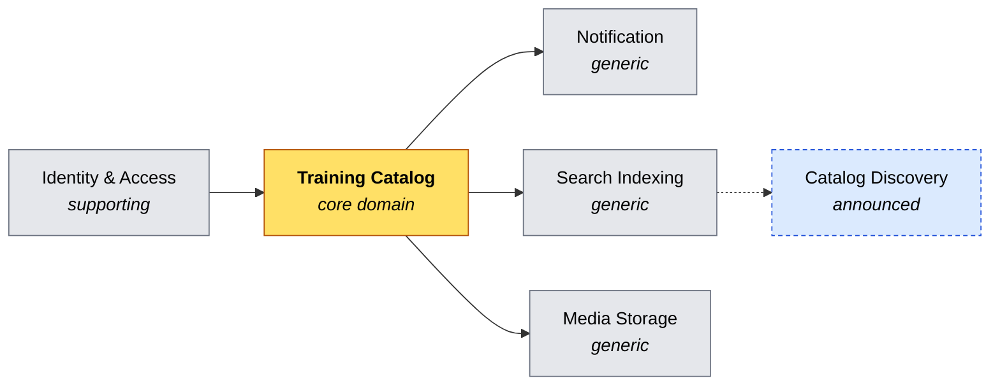

# Strategic design

The tactical side of Domain-Driven Design is visible in the code: aggregates, value objects, domain
events, specifications, repositories. The strategic side is not — it is the set of decisions about
**where the lines are and why**, and those leave no trace in a class.

These four documents hold that half. Everything in them is read off the model as it stands; nothing
is aspirational unless it says so.

## The domain, in one page

A **trainer** signs up, keeps a professional profile — a name, a contact address, a bio, a portrait
— and publishes the **trainings** they teach. A training has a title, a description, what a
participant needs beforehand, what they leave with, and one or more **topics** drawn from a closed
set of six.

That is the whole business today. Two facts about it are worth stating immediately, because they
explain most of the design:

**A training is a catalog entry, not a scheduled event.** It has no date, no session, no capacity
and no price. Nobody enrols in anything. The system describes what is on offer; it does not run it.

**Everything is scoped to its owner.** A trainer reads and writes their own profile and their own
trainings, and nothing else. There is no browsing, no directory, no search — those endpoints existed
once and were removed rather than restricted, because a read scoped to one caller is not a catalog
read. The public catalog is the announced next step, and parts of the model are already shaped for
it.

## The map, at a glance

One core domain, one supporting context bought off the shelf, three generic subdomains behind ports,
and one context that does not exist yet but has already shaped three decisions.

## The documents

| Document | Answers |
|---|---|
| [bounded-contexts.md](bounded-contexts.md) | What each context owns, in whose language, with which aggregates, actors, capabilities and use cases — and why there are two contexts rather than four |
| [context-map.md](context-map.md) | Who depends on whom, under which DDD pattern, and **where the seam is visible in the code** |
| [event-storming.md](event-storming.md) | The two main flows as commands, events, policies and invariants — with the open questions marked |

Read them in that order. Each is self-contained; together they take about fifteen minutes.

## An honest note on scale

This is a small domain: two aggregates, fourteen domain events, thirty use cases. A strategic-design
document for a system this size risks being longer than the model it describes, and risks inventing
boundaries to fill the page.

Three choices keep it from doing that:

- **No boundary is drawn that the code does not honor.** `Trainer` and `Training` are the obvious
  candidates for a split, and [bounded-contexts.md](bounded-contexts.md) argues in three points why
  they are one context. Getting that wrong is the standard way these documents become fiction.
- **What is intended is separated from what is built.** *Catalog Discovery* is on the map because
  three existing decisions were made for it. *Scheduling* and *Enrollment* are named in a section
  called **Not decided**, and kept off the map on purpose. There was briefly a third category,
  **Decided, not yet built**, holding the training lifecycle of
  [ADR 0050](../adr/0050-retire-a-training-rather-than-delete-it.md) while the record was
  `Proposed`: its terms were promised to be types and were not yet, so they were kept outside the
  sections the rules read. The lifecycle is built, so the section is gone and the terms sit in the
  language table where every other term does. The category was never meant to have residents for
  long.
- **The documents answer to a test.** See below.

## How this stays true

Documentation goes stale silently, which is the one failure mode this repository refuses everywhere
else — the README's project graph is compared edge by edge with the real project references, and
every architecture decision record is defended by a rule ([ADR 0013](../adr/0013-make-every-record-answer-to-a-test.md)).

The same treatment applies here. `StrategicDesignRules` checks six things on every build:

| Rule | What it prevents |
|---|---|
| `EveryAggregate_IsPlacedInExactlyOneBoundedContext` | A third aggregate arriving and belonging, on paper, to nothing |
| `EveryDomainEvent_AppearsInTheEventStorming` | A new business fact that the boards never mention |
| `EveryDomainService_AppearsInTheEventStorming` | A decision no aggregate could own, drawn nowhere |
| `EveryTermInTheUbiquitousLanguage_IsATypeInTheDomain` | The document and the code calling the same thing by different names |
| `EveryContextOnTheMap_HasItsOwnSection` | The map and the descriptions drifting apart |
| `EveryContextOnTheMap_AgreesWithItsSectionsStatus` | The map calling a context built while its own section still calls it a port |

Two more hold what these documents *enumerate* rather than what they name:
`EveryNamedList_AgreesWithTheCode` derives each list of facts from the consumers that read them
([ADR 0041](../adr/0041-derive-every-named-list-from-the-code.md)), and
`EveryCountedClaim_AgreesWithTheCode` does the same for every number on this page
([ADR 0038](../adr/0038-derive-every-counted-claim-from-the-code.md)).

The reasoning behind this documentation — why it lives here rather than among the records, and what
it deliberately leaves open — is in
[ADR 0023](../adr/0023-document-the-strategic-design-and-hold-it-to-the-model.md).

## Where to go next

- The tactical patterns, in prose: [the README's domain model](../../README.md#domain-model).
- The decisions and their rejected alternatives: [the records](../adr/).
- The decisions as executable rules: `tests/TrainingHub.Architecture.Tests/Rules/`.
