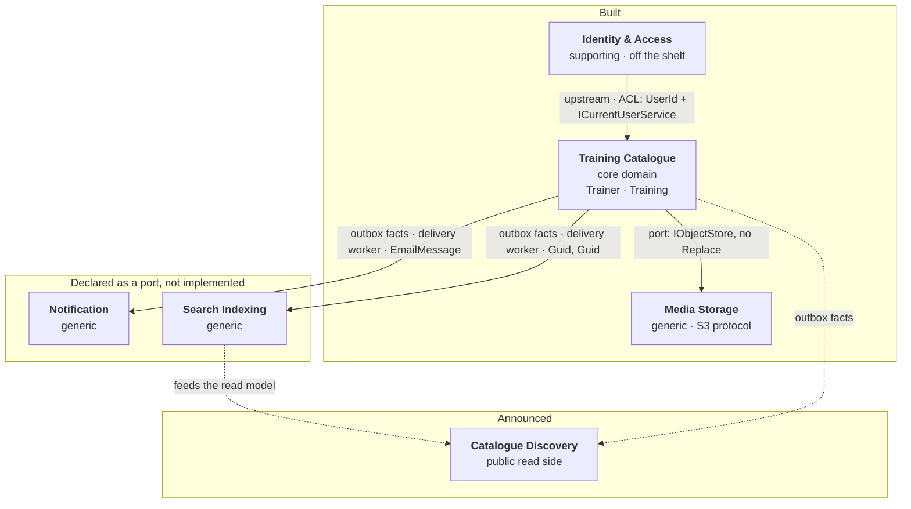

# Context map

Who depends on whom, in which direction, and — the part most context maps leave out — **where the
seam is visible in the code**. A relationship you cannot point at is a relationship nobody is
keeping.

## The map

## Contexts on this map

| Context | Kind | State |
|---|---|---|
| Training Catalogue | Core domain | Built |
| Identity & Access | Supporting | Built — off the shelf |
| Media Storage | Generic | Built |
| Notification | Generic | Port only |
| Search Indexing | Generic | Port only |
| Catalogue Discovery | Core (read side) | Announced |

Each has its own section in [bounded-contexts.md](bounded-contexts.md), and an architecture rule
checks that the two lists agree.

---

## Identity & Access → Training Catalogue

**Pattern:** customer/supplier, with an **anti-corruption layer**. Identity is upstream: it decides
what an account is, and the catalogue adapts.

**Why an ACL and not conformity.** The catalogue refuses to adopt Identity's model. It does not
store an `IdentityUser`, it does not treat the account's email as the trainer's contact address, and
it does not let a controller pass an account identifier where a trainer is expected. Conforming
would have been less code and would have produced the bug the code names out loud: *"conflating them
is what lets one caller edit another's work."*

**The seam, in three files:**

| File | What it does |
|---|---|
| `Shared.Domain/UserId.cs` | The only account-shaped thing the domain owns — an opaque typed identifier |
| `Shared/ICurrentUserService.cs` | Translates a request into **both** `UserId` and `TrainerId`, as separate properties |
| `Shared.Infrastructure/ThirdParty/Identity/TrainingIdentityDbContext.cs` | A `DbContext` of its own, with its own migration history |

**What it costs.** Two identifiers for one person, and a mapping to maintain. Bought in exchange for
being able to replace the authentication scheme without touching an aggregate.

---

## The one place both write sides commit together

Registration is the exception, and it is worth stating plainly rather than hiding behind the map.

`AuthControllerBase.RegisterAsync` opens a `TransactionScope` around **both** the creation of the
Identity account and the creation of the `Trainer`. Either both exist or neither does.

**Why this is acceptable here:** the two contexts share one physical database, so this is a local
transaction rather than a distributed one — no coordinator, no two-phase commit, no partial-failure
protocol.

**What it would cost to separate them:** the moment Identity moves to its own store, this becomes a
saga — create the account, then create the trainer, then compensate by deleting the account if the
second step fails. That is a real design, not a refactoring, and the code marks the spot: the
transaction is completed only when the whole registration succeeded.

**The rule this protects:** there is no such thing as an account without a trainer. `POST /Trainer`
does not exist; a trainer comes into being through registration or not at all.

---

## Training Catalogue → Notification

**Pattern:** open host service with a **published language**, in miniature.

The catalogue publishes facts; the notifier consumes them. The contract is `EmailMessage(Recipient,
Subject, Body)` — three strings, no domain type. The notifier cannot develop an opinion about
trainers because it is never shown one.

**The seam:** `Shared.Application/Notifications/IEmailSender.cs` — and, since the outbox landed, the facts that feed it:
`TrainerCreatedIntegrationEvent` and `TrainerContactEmailChangedIntegrationEvent`, committed to the
outbox by two policies in `Shared.Application/EventHandlers/` (ADR 0002, ADR 0024).

**State:** real, since [ADR 0031](../adr/0031-send-email-over-smtp-and-prove-it-against-a-real-server.md):
the two facts land durably with the changes that justify them, the delivery worker (ADR 0025)
hands them to the policies that compose the `EmailMessage`s, and a MailKit adapter sends each one
over SMTP — to a Mailpit container locally, to whatever relay the `Smtp` section names elsewhere.
Choosing a provider was, as promised, a registration in the composition root; the integration
suites read the delivered messages back out of the real server.

---

## Training Catalogue → Search Indexing

**Pattern:** open host service with a published language, and the clearest example of one here.

`IndexAsync(Guid trainingId, Guid trainerId)` takes **primitives**. The port's own remark explains
the decision: *"the search engine sitting behind it knows nothing about the domain's typed
identifiers."* Passing `TrainingId` would have made the index a downstream *conformist* of the
domain model; passing `Guid` keeps the contract translatable.

**The seam:** `Shared/ITrainingSearchIndexer.cs` — and the facts that will feed it:
`TrainingCreatedIntegrationEvent` and `TrainingEditedIntegrationEvent`, committed to the outbox by
two policies (ADR 0002, ADR 0024).

**State:** one fake implementation, fed by the outbox's consumers after each commit: the delivery
worker (ADR 0025) replays the committed facts into this port, so the index only ever learns of
trainings the database accepted. The index's consumer is Catalogue Discovery, which does not
exist.

---

## Training Catalogue → Media Storage

**Pattern:** generic subdomain behind a port, with a deliberately reduced interface.

Three operations — put, get, delete — and **no replace**. That absence carries the safety argument:
replacing a photo means writing a *new* key, committing the row that names it, then deleting what
was displaced. A `Replace` operation would read as one atomic step, would be implemented as an
overwrite, and would put that ordering out of reach of everyone who called it. See
[ADR 0021](../adr/0021-store-a-photo-beside-the-row-that-names-it.md).

**The seam, in layers:**

| Layer | Speaks |
|---|---|
| `Trainer.Photo` | A `TrainerPhoto` — an identity, a media type, a size. Never an address |
| `ITrainerPhotoStore` | Trainers and photos |
| `IObjectStore` | Keys and bytes |
| `S3ObjectStore` | Buckets and endpoints |

The key layout — `trainers/{trainerId}/{photoId}` — belongs to the third layer and to nothing above
it. An architecture rule holds the claim that exactly one project in the solution has ever heard of
the AWS SDK.

---

## Training Catalogue → Catalogue Discovery *(announced)*

**Expected pattern:** downstream read model, fed by domain events, with its own storage and its own
language.

**Why it is on the map before it exists:** because three pieces of the current model were shaped for
it, and a reader who does not know that will read them as over-engineering.

| Already there | For |
|---|---|
| `ITrainingSearchIndexer`, maintained on every create and edit | The search index a public page would read |
| `GET /Trainer/{id}/photo`, addressed by identifier, immutable cache, `ETag` from the photo's identity | A portrait served publicly, behind a CDN |
| A CQRS query side that projects into DTOs without loading aggregates | A read model that does not pay for the write model |

**What is not decided:** whether discovery gets its own store, or reads a projection of the same
database. The facts it would subscribe to are now durable — `TrainingCreatedIntegrationEvent` and
`TrainingEditedIntegrationEvent` land in the transactional outbox with every commit (ADR 0024) —
but the subscriber still does not exist.

---

## How to read the direction of an arrow

Upstream is whoever can change without asking. In this map:

- **Identity is upstream of the catalogue** — the framework's model changes on its own schedule, and
  the ACL absorbs it.
- **The catalogue is upstream of everything else** — it publishes facts, and the consumers adapt.
  That is why every port it owns speaks the smallest possible vocabulary: a published language is
  only cheap to keep if there is little of it.
