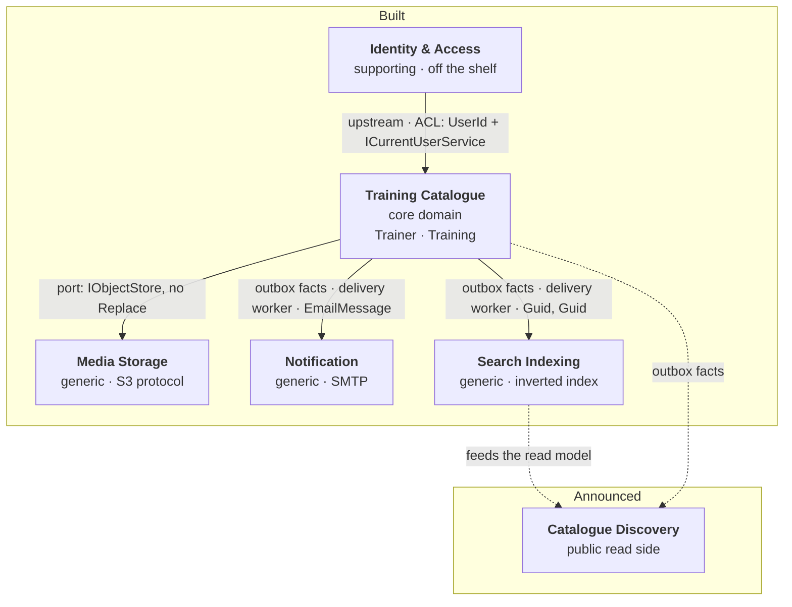

# Context map

Who depends on whom, in which direction, and — the part most context maps leave out — **where the
seam is visible in the code**. A relationship you cannot point at is a relationship nobody is
keeping.

## The map

## Contexts on this map

| Context | Kind | State |
|---|---|---|
| Training Catalogue | Core domain | Built |
| Identity & Access | Supporting | Built — off the shelf |
| Media Storage | Generic | Built |
| Notification | Generic | Built |
| Search Indexing | Generic | Built |
| Catalogue Discovery | Core (read side) | Announced |

Each has its own section in [bounded-contexts.md](bounded-contexts.md), and an architecture rule
checks that the two lists agree.

---

## Identity & Access → Training Catalogue

**Pattern:** customer/supplier, with an **anti-corruption layer**. Identity is upstream: it decides
what an account is, and the catalogue adapts.

**Why an ACL and not conformity.** The catalogue refuses to adopt Identity's model. It does not
store an `IdentityUser`, it does not treat the account's email as the trainer's contact address, and
it does not let a controller pass an account identifier where a trainer is expected. Conforming
would have been less code and would have produced the bug the code names out loud: *"conflating them
is what lets one caller edit another's work."*

**The seam, in three files:**

| File | What it does |
|---|---|
| `Shared.Domain/UserId.cs` | The only account-shaped thing the domain owns — an opaque typed identifier |
| `Shared/ICurrentUserService.cs` | Translates a request into **both** `UserId` and `TrainerId`, as separate properties |
| `Shared.Infrastructure/ThirdParty/Identity/TrainingIdentityDbContext.cs` | A `DbContext` of its own, with its own migration history |

**What it costs.** Two identifiers for one person, and a mapping to maintain. Bought in exchange for
being able to replace the authentication scheme without touching an aggregate.

---

## The one place both write sides commit together

Registration is the exception, and it is worth stating plainly rather than hiding behind the map.

`AuthControllerBase.RegisterAsync` opens a `TransactionScope` around **both** the creation of the
Identity account and the creation of the `Trainer`. Either both exist or neither does.

**Why this is acceptable here:** the two contexts share one physical database, so this is a local
transaction rather than a distributed one — no coordinator, no two-phase commit, no partial-failure
protocol.

**What it would cost to separate them:** the moment Identity moves to its own store, this becomes a
saga — create the account, then create the trainer, then compensate by deleting the account if the
second step fails. That is a real design, not a refactoring, and the code marks the spot: the
transaction is completed only when the whole registration succeeded.

**The rule this protects:** there is no such thing as an account without a trainer. `POST /Trainer`
does not exist; a trainer comes into being through registration or not at all.

---

## Training Catalogue → Notification

**Pattern:** open host service with a **published language**, in miniature.

The catalogue publishes facts; the notifier consumes them. The contract is `EmailMessage(Recipient,
Subject, Body)` — three strings, no domain type. The notifier cannot develop an opinion about
trainers because it is never shown one.

**The seam:** `Shared.Application/Notifications/IEmailSender.cs` — and, since the outbox landed, the facts that feed it:
`TrainerCreatedIntegrationEvent`, `TrainerContactEmailChangedIntegrationEvent`,
`TrainerSuspendedIntegrationEvent`, `TrainerReinstatedIntegrationEvent` and
`TrainingWithheldIntegrationEvent`, committed to the
outbox by five policies in `Shared.Application/EventHandlers/` (ADR 0002, ADR 0024, ADR 0056).
A second port sits beside the sender for the three sanction notices, `ITrainerAccountQuery` —
one of the three read ports in `Shared.Application/Queries/`, and the only one that opens two
stores. Those notices are addressed to the account rather than to the published contact address,
and it answers where that is when the notice is sent rather than when the decision committed.

**State:** real, since [ADR 0031](../adr/0031-send-email-over-smtp-and-prove-it-against-a-real-server.md):
the facts land durably with the changes that justify them, the delivery worker (ADR 0025)
hands them to the policies that compose the `EmailMessage`s, and a MailKit adapter sends each one
over SMTP — to a Mailpit container locally, to whatever relay the `Smtp` section names elsewhere.
Choosing a provider was, as promised, a registration in the composition root; the integration
suites read the delivered messages back out of the real server.

---

## Training Catalogue → Search Indexing

**Pattern:** open host service with a published language, and the clearest example of one here.

`IndexAsync(Guid trainingId, Guid trainerId)` takes **primitives**. The port's own remark explains
the decision: *"the search engine sitting behind it knows nothing about the domain's typed
identifiers."* Passing `TrainingId` would have made the index a downstream *conformist* of the
domain model; passing `Guid` keeps the contract translatable.

The language now has a read half as well, `ITrainingSearchQuery`, which
[ADR 0055](../adr/0055-let-the-administration-read-what-the-catalogue-may-not.md) refused to open
until there was an index behind it and
[ADR 0059](../adr/0059-give-the-search-index-a-body-and-a-query-surface.md) opens now that there is.

**The seam:** `Shared.Application/Search/ITrainingSearchIndexer.cs` — and the facts that feed it:
`TrainingCreatedIntegrationEvent`, `TrainingEditedIntegrationEvent`,
`TrainingTransferredIntegrationEvent`, `TrainingPublishedIntegrationEvent`,
`TrainingUnpublishedIntegrationEvent`, `TrainingDeletedIntegrationEvent`,
`TrainingWithheldIntegrationEvent`, `TrainerSuspendedIntegrationEvent` and
`TrainerReinstatedIntegrationEvent`, committed to the outbox
by nine policies (ADR 0002, ADR 0024, ADR 0056). The port answers four operations, not one:
`RemoveAsync` is what a withdrawal, a deletion and a withholding call, and its absence is what used
to leave a deleted training in the index for ever (ADR 0050); `HideTrainerCatalogueAsync` and
`ShowTrainerCatalogueAsync` are what a sanction calls, one call about a trainer rather than one per
training, because a suspension writes to none of them.

**State:** built (ADR 0059). Two tables of this database — one entry per training, one row per word
of its title — written by a single adapter and read through the port's query half. The write side is
unchanged: the delivery worker (ADR 0025) replays the committed facts into this port after each
commit, so the index only ever learns of trainings the database accepted, and it learns of them
eventually rather than at once. The port carries no document, so the adapter reads back the one
training a fact spoke about; a public visibility composed from two aggregates and stored nowhere on
the write side (ADR 0050, ADR 0056) is stored here, which is what a read model is for.

Its first reader is `GET /Catalogue/trainings`, the one anonymous endpoint of this API. That is the
*query surface* ADR 0055 named, not a catalogue page: Catalogue Discovery — facets, listings, a
store of its own — still does not exist.

**Why a transfer is one of the nine.** Nothing about the training's content changes when it
changes hands, which is why it looks like an ownership detail and is not: the index is what a
public catalogue would read, and the trainer a training is filed under is part of what that page
shows. A seam described as fed by *create and edit* is a seam that would serve the wrong author
([ADR 0036](../adr/0036-model-the-decision-that-has-no-home-as-a-domain-service.md)).

**Why withdrawal and deletion are two of the nine, and not one.** Both call `RemoveAsync`, and merging
them would look like a simplification. It would cost the index the only distinction that matters
downstream: a withdrawn training is one its owner can offer again, and a deleted one is gone. A
consumer that will one day do more than remove — retain a tombstone, keep a redirect, count what a
trainer withdrew — must not have to guess which happened
([ADR 0050](../adr/0050-retire-a-training-rather-than-delete-it.md)).

---

## Training Catalogue → Media Storage

**Pattern:** generic subdomain behind a port, with a deliberately reduced interface.

Three operations — put, get, delete — and **no replace**. That absence carries the safety argument:
replacing a photo means writing a *new* key, committing the row that names it, then deleting what
was displaced. A `Replace` operation would read as one atomic step, would be implemented as an
overwrite, and would put that ordering out of reach of everyone who called it. See
[ADR 0021](../adr/0021-store-a-photo-beside-the-row-that-names-it.md).

**The seam, in layers:**

| Layer | Speaks |
|---|---|
| `Trainer.Photo` | A `TrainerPhoto` — an identity, a media type, a size. Never an address |
| `ITrainerPhotoStore` | Trainers and photos |
| `IObjectStore` | Keys and bytes |
| `S3ObjectStore` | Buckets and endpoints |

The key layout — `trainers/{trainerId}/{photoId}` — belongs to the third layer and to nothing above
it. An architecture rule holds the claim that exactly one project in the solution has ever heard of
the AWS SDK.

---

## Training Catalogue → Catalogue Discovery *(announced)*

**Expected pattern:** downstream read model, fed by domain events, with its own storage and its own
language.

**Why it is on the map before it exists:** because three pieces of the current model were shaped for
it, and a reader who does not know that will read them as over-engineering.

| Already there | For |
|---|---|
| A real search index, maintained on every create, edit, transfer, publication and withdrawal, cleared on deletion, told a trainer's standing in one call, and readable through `ITrainingSearchQuery` (ADR 0059) | The search a public page would read, already answering at `GET /Catalogue/trainings` |
| `GET /Trainer/{id}/photo`, addressed by identifier, immutable cache, `ETag` from the photo's identity | A portrait served publicly, behind a CDN |
| A CQRS query side that projects into DTOs without loading aggregates | A read model that does not pay for the write model |

**What is not decided:** whether discovery gets its own store, or reads a projection of the same
database. The facts it would subscribe to are now durable — `TrainingCreatedIntegrationEvent`,
`TrainingEditedIntegrationEvent`, `TrainingTransferredIntegrationEvent`,
`TrainingPublishedIntegrationEvent`, `TrainingUnpublishedIntegrationEvent`,
`TrainingDeletedIntegrationEvent`, `TrainingWithheldIntegrationEvent`,
`TrainerSuspendedIntegrationEvent` and `TrainerReinstatedIntegrationEvent` land in the
transactional outbox with every commit (ADR 0024, ADR 0056) —
but the subscriber still does not exist. What ADR 0050 added to that list is the ability to express
what a public catalogue must *not* show, and ADR 0056 the ability to express it about a trainer
rather than about each of their trainings — which is what makes this context buildable rather than
merely announced. ADR 0059 went one step further and built the index those facts maintain, so what
is missing here is no longer a store: it is a page, its facets, its ordering by anything other than
a title, and whatever else a discovery experience turns out to be.

---

## How to read the direction of an arrow

Upstream is whoever can change without asking. In this map:

- **Identity is upstream of the catalogue** — the framework's model changes on its own schedule, and
  the ACL absorbs it.
- **The catalogue is upstream of everything else** — it publishes facts, and the consumers adapt.
  That is why every port it owns speaks the smallest possible vocabulary: a published language is
  only cheap to keep if there is little of it.
