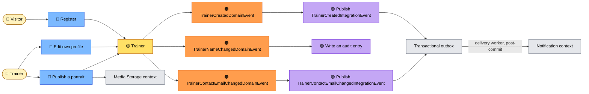

# Event storming

## Is this worth doing here?

Event storming earns its keep in two ways: **discovering** a domain nobody has modelled yet, and
**explaining** one that is already built. On a domain of two aggregates and seven events, there is
nothing left to discover — so this document makes no pretence of being a workshop record. It is here
for the second reason, and one property of this codebase makes it unusually effective:

> **The reactions are already named as policies.** `DeleteTrainingWhenTrainerDeleted`,
> `AuditWhenTrainerNameChanged`, `PublishIntegrationEventWhenTrainerCreated`.

Those are file names in `Shared.Application/EventHandlers/`. The *when X then Y* notation of an
event storming does not have to be invented for this repository — it maps one-to-one onto files that
exist. A reader who understands the boards below can open any handler and recognise it.

What this document is **not**: exhaustive. Commands that only read are left out, and so is every
validation failure that never reaches the domain.

## Notation

| Colour | Means | Where it lives in the code |
|---|---|---|
| 🟠 **Domain event** | A business fact, past tense | `…/DomainEvents/*.cs` |
| 🔵 **Command** | An intent, imperative | An application service, or a `*Command` |
| 🟡 **Aggregate** | What decides whether the command is allowed | `Trainer`, `Training` |
| 🟣 **Policy** | *When this happened, do that* | `…/EventHandlers/*.cs` |
| 🟢 **Read model** | What a screen reads | A `*Dto`, a query handler |
| 👤 **Actor** | Who starts it | — |
| 🔴 **Hotspot** | An open question | — |

---

## Board 1 — Becoming a trainer, and having a face

### What the board is really saying

**Registration crosses a boundary.** `Register` creates an Identity account *and* a `Trainer`,
inside one `TransactionScope`. It is the only command in the system that writes to two contexts —
see [context-map.md](context-map.md).

**Editing a profile raises one event per attribute that actually changed.** `Trainer.Edit` compares
before assigning, so renaming yourself without touching your address raises one event, not two. The
events carry **both the old and the new value**, and that is what makes the two policies possible:
the audit entry is complete without loading anything, and the warning can be sent to an address the
aggregate has already forgotten.

**Warning the previous address is a security policy, not a courtesy.** If the change was not the
trainer's doing, the message reaches the person who still controls the old mailbox. It exists
because the event carries the old value — a design decision on the event, paying off in a policy.
Since the outbox landed, the policy's job is to commit the fact — both addresses, flattened into
`TrainerContactEmailChangedIntegrationEvent` — atomically with the change itself; the delivery
worker then hands it to the consumer that composes and sends the warning, for a change that is
guaranteed real.

**Publishing a portrait raises nothing at all**, and that is deliberate. A domain event would need a
handler; handlers here run *inside* the transaction the aggregate is being saved in; and deleting
the displaced bytes inside a transaction that may still roll back is the worst available moment. The
cleanup stays in the use case, after the commit.

### 🔴 Hotspots

- **Nothing removes a trainer.** The rule exists (`Trainer.MarkForDeletion`), the event exists
  (`TrainerDeletedDomainEvent`), the policy exists — and no actor can trigger any of it.

---

## Board 2 — Publishing a training

```mermaid
flowchart LR
    A(["👤 Trainer"]) --> C1["🔵 Create a training"]
    A --> C2["🔵 Edit a training"]
    A --> C3["🔵 Delete a training"]
    A --> C4["🔵 Transfer a training"]
    B(["👤 Recipient trainer"]) -.->|"receives"| C4

    C1 --> AG["🟡 Training"]
    C2 --> AG
    C3 --> AG
    C4 --> DS["TrainingTransferDomainService"]
    DS --> AG

    AG --> INV{{"⚠ A title is unique<br/>per trainer"}}
    DS --> INV2{{"⚠ The recipient has room<br/>and is free of the title"}}
    INV --> E1["🟠 TrainingCreatedDomainEvent"]
    INV --> E2["🟠 TrainingEditedDomainEvent"]
    INV2 --> E4["🟠 TrainingTransferredDomainEvent"]

    E1 --> P1["🟣 Publish TrainingCreatedIntegrationEvent"]
    E2 --> P2["🟣 Publish TrainingEditedIntegrationEvent"]
    E4 --> P4["🟣 Publish TrainingTransferredIntegrationEvent"]
    P1 --> OB["Transactional outbox"]
    P2 --> OB
    P4 --> OB
    OB -->|"delivery worker, post-commit"| SI["Search Indexing context"]

    SI -.-> RM["🟢 Future public catalogue"]

    TD["🟠 TrainerDeletedDomainEvent"] --> P3["🟣 Delete the trainer's trainings"]
    P3 --> AG

    classDef event fill:#ff9d4d,stroke:#c2410c,color:#000
    classDef command fill:#7cb9ff,stroke:#1d4ed8,color:#000
    classDef aggregate fill:#ffe066,stroke:#b45309,color:#000
    classDef policy fill:#c4a7f5,stroke:#6d28d9,color:#000
    classDef actor fill:#fff3bf,stroke:#a16207,color:#000
    classDef readmodel fill:#86efac,stroke:#15803d,color:#000
    classDef external fill:#e5e7eb,stroke:#6b7280,color:#000
    classDef invariant fill:#fecaca,stroke:#b91c1c,color:#000

    class E1,E2,E4,TD event
    class C1,C2,C3,C4 command
    class AG,DS aggregate
    class P1,P2,P3,P4 policy
    class A,B actor
    class RM readmodel
    class SI,OB external
    class INV,INV2 invariant
```

### What the board is really saying

**One rule guards both writes.** Creating and editing go through the same private method, and it
checks the same thing: a trainer may not list the same title twice. Creation is edition applied to
an empty draft — which is why `Training.CreateAsync` is asynchronous while `Trainer.Create` is not.
The trainer aggregate has no rule it cannot answer alone; the training aggregate has exactly one.

**Two events, two facts, one future consumer.** `Created` and `Edited` publish two distinct
integration events even though the indexer that will consume them upserts and could treat them
alike. They are kept apart on the wire so the reactions can diverge — an edit might one day also
invalidate a cache or notify subscribed students, and a create never would — and a consumer that
cares about the difference must not have to guess it back out of a merged message.

**Deleting a trainer reaches into another aggregate.** `TrainerDeletedDomainEvent` is handled by a
policy that deletes trainings *inside the same unit of work*. This is the strongest evidence that
`Trainer` and `Training` share a bounded context: across a real boundary this would have to be an
integration event and an eventual, compensable deletion.

**The transfer is the board's first multi-actor edge — and its one domain service.** Handing a
training over reads the *recipient's* catalogue to mutate the *giver's* training, a decision no
aggregate can own: `TrainingTransferDomainService` decides through the same two ports creation uses,
and only it can reach the aggregate's internal reassignment (ADR 0036).

### 🔴 Hotspots

- **Deleting a training raises no event**, so nothing removes it from the search index. Harmless
  while the index is a fake; a real one would serve a training that no longer exists.
- **Which uniqueness wins under concurrency?** The rule is checked before the write, and a unique
  index in the database is what actually enforces it — the check produces a good message, the
  constraint produces the guarantee.

---

## Design level — every event, in one table

| Command | Aggregate | Rule it must satisfy | Event raised | Policy | Handler |
|---|---|---|---|---|---|
| Register | `Trainer` | Username and account email unique *(Identity)* | `TrainerCreatedDomainEvent` | Commit `TrainerCreatedIntegrationEvent` to the outbox; the worker sends the welcome email after the commit | `PublishIntegrationEventWhenTrainerCreatedEventHandler` |
| Edit own profile | `Trainer` | Name and address valid by construction | `TrainerNameChangedDomainEvent` | Record the change | `AuditWhenTrainerNameChangedEventHandler` |
| Edit own profile | `Trainer` | — | `TrainerContactEmailChangedDomainEvent` | Commit `TrainerContactEmailChangedIntegrationEvent` to the outbox; the worker warns the old address after the commit | `PublishIntegrationEventWhenTrainerContactEmailChangedEventHandler` |
| *(no command yet)* | `Trainer` | A trainer does not leave alone | `TrainerDeletedDomainEvent` | Delete their trainings | `DeleteTrainingWhenTrainerDeletedEventHandler` |
| Create a training | `Training` | Title unique per trainer; the trainer publishes fewer than ten | `TrainingCreatedDomainEvent` | Commit `TrainingCreatedIntegrationEvent` to the outbox; the worker indexes after the commit | `PublishIntegrationEventWhenTrainingCreatedEventHandler` |
| Edit a training | `Training` | Title unique per trainer | `TrainingEditedDomainEvent` | Commit `TrainingEditedIntegrationEvent` to the outbox; the worker reindexes after the commit | `PublishIntegrationEventWhenTrainingEditedEventHandler` |
| Transfer a training | `Training`, decided by `TrainingTransferDomainService` | Recipient publishes fewer than ten; recipient free of the title | `TrainingTransferredDomainEvent` | Commit `TrainingTransferredIntegrationEvent` to the outbox; the worker reindexes under the new owner after the commit | `PublishIntegrationEventWhenTrainingTransferredEventHandler` |
| Publish a portrait | `Trainer` | ≤ 5 MiB, PNG/JPEG/WebP, content matches the declared type | *(none, deliberately)* | — | — |
| Remove a portrait | `Trainer` | — | *(none, deliberately)* | — | — |
| Delete a training | `Training` | Caller owns it | *(none — a hotspot)* | — | — |

Seven events, seven handlers, and three commands that raise nothing — two by decision, and one,
deleting a training, that the board marks as a hotspot. The two the model refuses deliberately are
as informative as the seven it raises. Of the seven reactions, two act inside
the transaction — the cascade and the audit line, ADR 0002's *domain* side — and five commit an
integration event into the outbox, to be acted on after the commit.

## What the boards show that the code does not

Reading the aggregates tells you what is allowed. Reading the boards tells you three things the code
never states in one place:

1. **Registration is the system's only cross-context write.** You would have to open five files to
   notice.
2. **Every reaction is a side effect the domain must not know about.** Outbox rows, audit entries,
   the emails and index updates the worker delivers — none of them is a business rule, and none of
   them lives in an aggregate.
3. **The events were designed for their policies.** Carrying the old *and* the new value looks like
   redundancy until you see the two policies that would be impossible without it.
