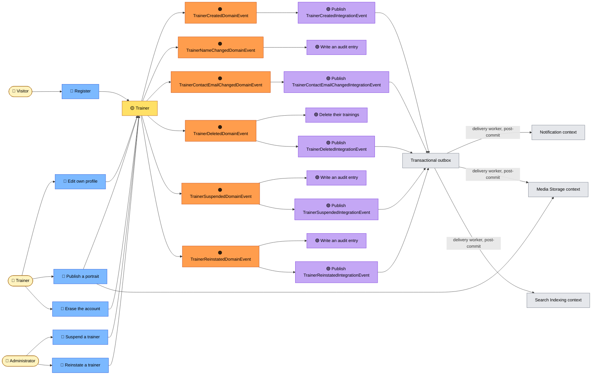
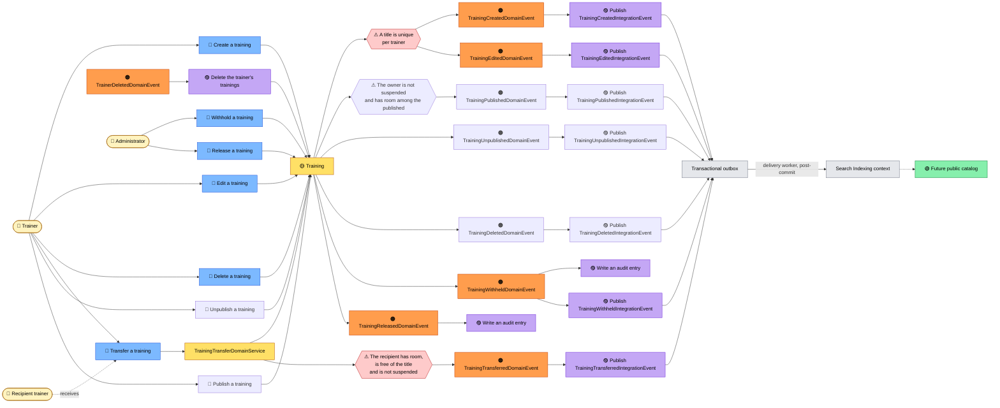

# Event storming

## Is this worth doing here?

Event storming earns its keep in two ways: **discovering** a domain nobody has modeled yet, and
**explaining** one that is already built. On a domain of two aggregates and fourteen events, there is
nothing left to discover — so this document makes no pretense of being a workshop record. It is here
for the second reason, and one property of this codebase makes it unusually effective:

> **The reactions are already named as policies.** `DeleteTrainingWhenTrainerDeleted`,
> `AuditWhenTrainerNameChanged`, `PublishIntegrationEventWhenTrainerCreated`.

Those are file names in `Shared.Application/EventHandlers/`. The *when X then Y* notation of an
event storming does not have to be invented for this repository — it maps one-to-one onto files that
exist. A reader who understands the boards below can open any handler and recognize it.

What this document is **not**: exhaustive. Commands that only read are left out, and so is every
validation failure that never reaches the domain.

## Notation

| Color | Means | Where it lives in the code |
|---|---|---|
| 🟠 **Domain event** | A business fact, past tense | `…/DomainEvents/*.cs` |
| 🔵 **Command** | An intent, imperative | An application service, or a `*Command` |
| 🟡 **Aggregate** | What decides whether the command is allowed | `Trainer`, `Training` |
| 🟣 **Policy** | *When this happened, do that* | `…/EventHandlers/*.cs` |
| 🟢 **Read model** | What a screen reads | A `*Dto`, a query handler |
| 👤 **Actor** | Who starts it | — |
| 🔴 **Hotspot** | An open question | — |

---

## Board 1 — Becoming a trainer, and having a face

### What the board is really saying

**Registration crosses a boundary.** `Register` creates an Identity account *and* a `Trainer`,
inside one `TransactionScope`. For a long time it was the only command in the system that wrote to
two contexts; erasure is now its mirror, in the same scope and the opposite direction — see
[context-map.md](context-map.md).

**Erasure is registration run backwards, and the fact carries what nothing can look up.** `Erase
the account` marks the trainer for deletion — the cascade deletes the trainings in the same unit
of work — deletes the Identity account, and commits two facts before the scope completes. The
policy above commits `TrainerDeletedIntegrationEvent` with the portrait's identity on it, because
its consumer, the collector that deletes the bytes, runs after the rows it could have asked are
gone. The farewell's fact belongs to Identity & Access and is committed by the endpoint itself —
see below with the recovery pair (ADR 0085).

**Editing a profile raises one event per attribute that actually changed.** `Trainer.Edit` compares
before assigning, so renaming yourself without touching your address raises one event, not two. The
events carry **both the old and the new value**, and that is what makes the two policies possible:
the audit entry is complete without loading anything, and the warning can be sent to an address the
aggregate has already forgotten.

**Warning the previous address is a security policy, not a courtesy.** If the change was not the
trainer's doing, the message reaches the person who still controls the old mailbox. It exists
because the event carries the old value — a design decision on the event, paying off in a policy.
Since the outbox landed, the policy's job is to commit the fact — both addresses, flattened into
`TrainerContactEmailChangedIntegrationEvent` — atomically with the change itself; the delivery
worker then hands it to the consumer that composes and sends the warning, for a change that is
guaranteed real.

**Publishing a portrait raises nothing at all**, and that is deliberate. A domain event would need a
handler; handlers here run *inside* the transaction the aggregate is being saved in; and deleting
the displaced bytes inside a transaction that may still roll back is the worst available moment. The
cleanup stays in the use case, after the commit.

### 🔴 Hotspots

None left on this board. The one that stood here longest — *nothing removes a trainer* — closed in
three parts, years of the board's life apart: ADR 0051 gave the administration its actor, the
administrative endpoints gave that actor its commands, and ADR 0085 opened the last door at the
account's own side. It closed the way the hotspot predicted it would: erasing a trainer is a right
the account holds, not a sanction the administration applies, and the two arrived by different
doors.

---

## Board 2 — Publishing a training

### What the board is really saying

**One rule guards both writes.** Creating and editing go through the same private method, and it
checks the same thing: a trainer may not list the same title twice. Creation is edition applied to
an empty draft — which is why `Training.CreateAsync` is asynchronous while `Trainer.Create` is not.
The trainer aggregate has no rule it cannot answer alone; the training aggregate has exactly one.

**One fact behind no aggregate at all.** `TrainerContactedIntegrationEvent` is the exception this
board could not have shown before ADR 0082: a visitor writing to a trainer changes nothing about
either aggregate, so no domain event precedes it and no handler translates one. The command
commits it directly, and the outbox row *is* the record that it happened — which is why it appears
here as a fact without a preceding blue sticky, and why the consumer that reads it,
`SendContactMessage`, resolves the trainer's published contact address at delivery rather than
carrying it on the wire.

**Four more of the same shape, one context over.** `PasswordResetRequestedIntegrationEvent`,
`EmailVerificationRequestedIntegrationEvent`, `PasswordChangedIntegrationEvent` and
`AccountErasedIntegrationEvent` belong to Identity & Access,
whose model is the framework's, so no blue sticky could ever precede them either: the recovery,
verification, and erasure endpoints commit them directly (ADR 0084, ADR 0085, ADR 0090). The first
two go further than the contact fact went — their consumers, `SendPasswordResetLink` and
`SendVerificationLink`, do not merely resolve a detail at
delivery, they *mint the secret* at delivery, so neither token ever touches the outbox row at
all. The verification fact carries the one thing its consumer could not resolve on its own — the
culture the requester was being served in, so the email arrives in the requester's language — and
deliberately not the address, which is read off the account at delivery like every notice's
(ADR 0056). The other two are the owner's alarm bells, each committed in the same transaction as the
change it announces — and the erasure's carries the address and the username on the wire, because
by delivery time the rows that held them are gone.

**Nine events, nine facts, one real consumer.** `TrainingCreatedIntegrationEvent`,
`TrainingEditedIntegrationEvent`, `TrainingTransferredIntegrationEvent`,
`TrainingPublishedIntegrationEvent`, `TrainingUnpublishedIntegrationEvent`,
`TrainingDeletedIntegrationEvent`, `TrainingWithheldIntegrationEvent`,
`TrainerSuspendedIntegrationEvent` and `TrainerReinstatedIntegrationEvent` are nine distinct
integration events even though the indexer that
consumes them upserts, removes and hides, and could treat several of them alike. They are kept apart on
the wire so the reactions can diverge — an edit might one day also invalidate a cache or notify
subscribed students, a create never would, a transfer is the only one that changes which trainer
the entry is filed under, and withdrawing is not deleting however identical the removal looks from
the index — and a consumer that cares about the difference must not have to guess it back out of a
merged message.

**A training now has a life, and both directions of it are on the wire.** Publishing and
unpublishing are the everyday pair; deleting stays for the training created by mistake and for
erasure. The three arrived together with ADR 0050, and it is the removal half that made the record
worth building: an index that keeps serving a withdrawn training turns the status into a field the
write side respects and every reader ignores.

**The withheld state is the board's one closed door.** Every other transition on this board is
reversible by the trainer who owns the training — publish and unpublish are a pair, and a deletion
is final for everybody. `Withhold` is the only one that takes a decision away from the owner and
gives it to somebody else: both of the owner's exits are refused by name, and only `Release`
reopens them (ADR 0052). It is also why the board now has a second actor issuing commands rather
than a second aggregate — the administration acts on `Training` through the same aggregate, with a
permission the trainer does not hold (ADR 0051).

**Deleting a trainer reaches into another aggregate.** `TrainerDeletedDomainEvent` is handled by a
policy that deletes trainings *inside the same unit of work*. This is the strongest evidence that
`Trainer` and `Training` share a bounded context: across a real boundary this would have to be an
integration event and an eventual, compensable deletion.

**The transfer is the board's first multi-actor edge — and its one domain service.** Handing a
training over reads the *recipient's* catalog to mutate the *giver's* training, a decision no
aggregate can own: `TrainingTransferDomainService` decides through the same two ports creation uses,
and only it can reach the aggregate's internal reassignment (ADR 0036).

### 🔴 Hotspots

- **Which uniqueness wins under concurrency?** The rule is checked before the write, and a unique
  index in the database is what actually enforces it — the check produces a good message, the
  constraint produces the guarantee.

---

## Design level — every event, in one table

| Command | Aggregate | Rule it must satisfy | Event raised | Policy | Handler |
|---|---|---|---|---|---|
| Register | `Trainer` | Username and account email unique *(Identity)* | `TrainerCreatedDomainEvent` | Commit `TrainerCreatedIntegrationEvent` to the outbox; the worker sends the welcome email after the commit | `PublishIntegrationEventWhenTrainerCreatedDomainEventHandler` |
| Edit own profile | `Trainer` | Name and address valid by construction | `TrainerNameChangedDomainEvent` | Record the change | `AuditWhenTrainerNameChangedDomainEventHandler` |
| Edit own profile | `Trainer` | — | `TrainerContactEmailChangedDomainEvent` | Commit `TrainerContactEmailChangedIntegrationEvent` to the outbox; the worker warns the old address after the commit | `PublishIntegrationEventWhenTrainerContactEmailChangedDomainEventHandler` |
| Erase the account | `Trainer` | The caller's own password is correct *(Identity)* | `TrainerDeletedDomainEvent` | Delete their trainings | `DeleteTrainingWhenTrainerDeletedDomainEventHandler` |
| Erase the account | `Trainer` | — | `TrainerDeletedDomainEvent` | Commit `TrainerDeletedIntegrationEvent` to the outbox; the worker collects the portrait's bytes after the commit | `PublishIntegrationEventWhenTrainerDeletedDomainEventHandler` |
| Create a training | `Training` | Title unique per trainer; the trainer publishes fewer than ten | `TrainingCreatedDomainEvent` | Commit `TrainingCreatedIntegrationEvent` to the outbox; the worker indexes after the commit | `PublishIntegrationEventWhenTrainingCreatedDomainEventHandler` |
| Edit a training | `Training` | Title unique per trainer | `TrainingEditedDomainEvent` | Commit `TrainingEditedIntegrationEvent` to the outbox; the worker reindexes after the commit | `PublishIntegrationEventWhenTrainingEditedDomainEventHandler` |
| Transfer a training | `Training`, decided by `TrainingTransferDomainService` | Recipient publishes fewer than ten; recipient free of the title | `TrainingTransferredDomainEvent` | Commit `TrainingTransferredIntegrationEvent` to the outbox; the worker reindexes under the new owner after the commit | `PublishIntegrationEventWhenTrainingTransferredDomainEventHandler` |
| Publish a portrait | `Trainer` | ≤ 5 MiB, PNG/JPEG/WebP, content matches the declared type | *(none, deliberately)* | — | — |
| Remove a portrait | `Trainer` | — | *(none, deliberately)* | — | — |
| Delete a training | `Training` | Caller owns it | `TrainingDeletedDomainEvent` | Commit `TrainingDeletedIntegrationEvent` to the outbox; the worker removes it from the index after the commit | `PublishIntegrationEventWhenTrainingDeletedDomainEventHandler` |
| Unpublish a training | `Training` | It is not already withdrawn | `TrainingUnpublishedDomainEvent` | Commit `TrainingUnpublishedIntegrationEvent` to the outbox; the worker removes it from the index after the commit | `PublishIntegrationEventWhenTrainingUnpublishedDomainEventHandler` |
| Publish a training | `Training` | It is withdrawn; the owner is not suspended and publishes fewer than ten | `TrainingPublishedDomainEvent` | Commit `TrainingPublishedIntegrationEvent` to the outbox; the worker indexes it after the commit | `PublishIntegrationEventWhenTrainingPublishedDomainEventHandler` |
| Suspend a trainer | `Trainer` | The trainer is not already suspended | `TrainerSuspendedDomainEvent` | Record the sanction | `AuditWhenTrainerSuspendedDomainEventHandler` |
| Suspend a trainer | `Trainer` | — | `TrainerSuspendedDomainEvent` | Commit `TrainerSuspendedIntegrationEvent` to the outbox; the worker notifies the account and hides the catalog after the commit | `PublishIntegrationEventWhenTrainerSuspendedDomainEventHandler` |
| Reinstate a trainer | `Trainer` | The trainer is suspended | `TrainerReinstatedDomainEvent` | Record the lifting | `AuditWhenTrainerReinstatedDomainEventHandler` |
| Reinstate a trainer | `Trainer` | — | `TrainerReinstatedDomainEvent` | Commit `TrainerReinstatedIntegrationEvent` to the outbox; the worker notifies the account and shows the catalog again after the commit | `PublishIntegrationEventWhenTrainerReinstatedDomainEventHandler` |
| Withhold a training | `Training` | It is not already withheld | `TrainingWithheldDomainEvent` | Record the decision and its reason | `AuditWhenTrainingWithheldDomainEventHandler` |
| Withhold a training | `Training` | — | `TrainingWithheldDomainEvent` | Commit `TrainingWithheldIntegrationEvent` to the outbox; the worker notifies the owner and removes the entry after the commit | `PublishIntegrationEventWhenTrainingWithheldDomainEventHandler` |
| Release a training | `Training` | It is withheld | `TrainingReleasedDomainEvent` | Record the lifting | `AuditWhenTrainingReleasedDomainEventHandler` |

Fourteen events, eighteen handlers, and two commands that raise nothing — both by decision.
Publishing and removing a portrait are as informative as the fourteen that do raise something: the
bytes live in a store a rollback could not put back, so the aggregate says nothing and the caller
cleans up after the commit. Of the eighteen reactions, six act inside the transaction — the
cascade and five audit lines, ADR 0002's *domain* side — and twelve commit an integration event
into the outbox, to be acted on after the commit.

No row carries *(no command yet)* any longer: the trainer-deletion row waited years for its
command and got it at the account's own door rather than the administration's (ADR 0085). Four
other commands changed hands along the way: suspending a trainer, reinstating one, withholding a
training and releasing it are administrative decisions, and they are issued by the four endpoints
under `/Administration`. Three of the four have since earned an integration event as well
(ADR 0056): the excuse ADR 0050 recorded — no surface raises the sanction, no context consumes it
— was retired by those endpoints and by the consumers now waiting, the notice to the trainer and
the index that has to stop offering what was taken down.

**One of the four will never earn one, and that is a decision rather than a delay.** Withholding has
consumers waiting — the owner to notify, the index entry to drop. Releasing has none: the training
lands on `Unpublished`, where it was not indexed and where nobody was listening. Same test, opposite
answer (ADR 0052).

## What the boards show that the code does not

Reading the aggregates tells you what is allowed. Reading the boards tells you three things the code
never states in one place:

1. **Registration is the system's only cross-context write.** You would have to open five files to
   notice.
2. **Every reaction is a side effect the domain must not know about.** Outbox rows, audit entries,
   the emails and index updates the worker delivers — none of them is a business rule, and none of
   them lives in an aggregate.
3. **The events were designed for their policies.** Carrying the old *and* the new value looks like
   redundancy until you see the two policies that would be impossible without it.
